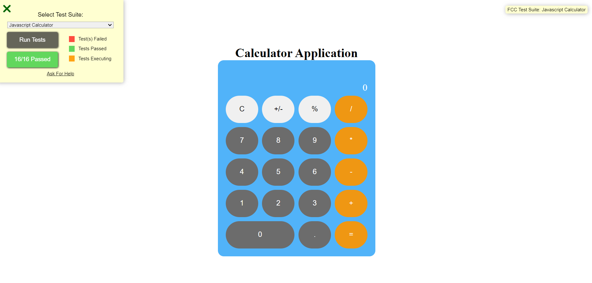

#  Build_calculator 🔁

## Description 📜
This project is a simple calculator built using react. It supports basic arithmetic operations such as addition, subtraction, multiplication, and division. The calculator is designed with a user-friendly interface and can be easily integrated into other projects or used as a standalone application.

## Features 🎉

- Basic Operations: Perform addition, subtraction, multiplication, and division.
- Responsive Design: The calculator adapts to different screen sizes and devices.
- Clear Function: Reset the calculator to its default state.
- Keyboard Support: Users can interact with the calculator using both mouse and keyboard.


## Demo 📸





## Technologies Used 💡

- React
- redux
- CSS

## Installation 🔧

1. Clone the repository:
```bash
   git clone https://github.com/Sharifarezaie/calculator.git
   cd build-calculator
```
2. Install dependencies:
```bash
npm install
```

3. Start the development server:
```bash 
npm start
```

# Usage 🔊
Open your browser to http://localhost:3000 to view the app. You can click the on buttons  button to hear new  different sound.
To use the calculator, simply enter numbers and select an operation (addition, subtraction, multiplication, division). You can clear the current calculation at any time by pressing the "Clear" button.


## Installation 💻

Folow these steps to set up the project on your local machine Ensure you have the following software installed on your machine

# git clone 

https://github.com/Sharifarezaie/calculator/

## Usage 🎯

you can access to my project through git clone -git clone the HTTP or My SSH code link from the repository you wat to clone

# git clone

# Acknowledgments
- freeCodeCamp for the project idea


## Author 👩‍💻 sharifa rezaie

- LinkedIn:https://www.linkedin.com/in/sharifa-rezaie-
- Email: sharifashaida82@gmail.com


# Contributing 🙏
Contributions are welcome! Please fork this repository and submit a pull request for any improvements or bug fixes.

